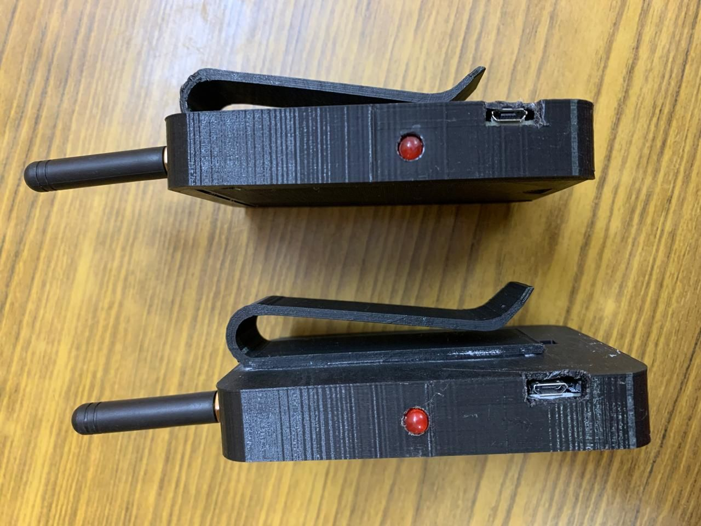

# LoRa – The Saviour  
*A Low-Cost Emergency Communication System Using ESP32 and LoRa*  

## Overview  
**LoRa – The Saviour** is a handheld device that enables **offline text messaging** between smartphones using a **Bluetooth-to-LoRa relay**. Designed for **trekkers, campers, and disaster-stricken areas**, this device provides a **reliable, low-power alternative to satellite messengers** when no cellular or Wi-Fi network is available.  

We have published a research paper on this project in the **IJRPR Journal**, contributing to advancements in **wireless communication** and **IoT technologies**.  

---

## Features  
- **Long-Range Communication** – LoRa technology enables low-power, high-distance messaging.  
- **Bluetooth Connectivity** – Seamless smartphone connection for intuitive use.  
- **Independent & Reliable** – Works without any cellular or Wi-Fi networks.  
- **Compact & Portable** – Lightweight design for outdoor and emergency applications.  

---

## Applications  
- **Disaster-stricken areas** – Maintain communication when networks are down.  
- **Trekking and camping** – Stay connected in remote regions with no mobile coverage.  
- **Emergency response** – A low-cost, rapidly deployable alternative to satellite devices.  

---

## Tech Stack  
- **Microcontroller:** ESP32  
- **Wireless Communication:** LoRa module  
- **Mobile Interface:** Bluetooth (Android app support)  
- **Firmware:** Arduino/Embedded C  
- **Other Tools:** 3D printed enclosure (optional if applicable)  

---

## Research Publication  
This project and its findings have been **published in the IJRPR Journal**.  
[Link to paper](https://drive.google.com/file/d/13FtI-TpBtMStCX1-7-HtiXbm_7wb8_lU/view?usp=sharing) 

---

## Hardware Setup  
1. ESP32 board + LoRa module  
2. Power supply (Li-ion battery or USB)  
3. Smartphone with companion app (Bluetooth enabled)  
4. Optional: 3D printed case for portability  

  
  
  
 

---

## How It Works  
1. The smartphone connects to the ESP32 device over **Bluetooth**.  
2. The device transmits text messages using **LoRa** to another paired device.  
3. The receiving device relays the message back to its connected smartphone.  
4. No cellular or Wi-Fi network is required at any stage.

--- 

## How to Make This Work

This project uses **two ESP32 boards**:
- **Module 1 (Server / SoftAP):** Creates a WiFi hotspot and forwards messages between Bluetooth and WiFi.
- **Module 2 (Client / Station):** Connects to the SoftAP and exchanges data with the first module, also forwarding between Bluetooth and WiFi.

### 1. Prerequisites
- 2 × ESP32 Development Boards  
- Arduino IDE or PlatformIO installed  
- USB cables for flashing  
- Android smartphone (with Bluetooth enabled)  
- Basic jumper wires and power source if needed  

### 2. Flashing the Code
1. Open the `server` folder and flash the `main.cpp` to **Module 1 (SoftAP)**.  
2. Open the `client` folder and flash the `main.cpp` to **Module 2 (Station)**.  
3. Make sure you update the WiFi SSID and password in the client code to match the server’s SoftAP settings.  

### 3. Wiring Setup
- **No additional wiring needed** beyond USB power if you're only using onboard Bluetooth and WiFi.  
- If powering from battery, ensure you use a regulated 5V/3.3V source.  

### 4. Running the System
1. Power up **Module 1 (Server)**. It will start:
   - A WiFi hotspot named `ESP32-Network`
   - A Bluetooth device named `ESP32-Server`
2. Power up **Module 2 (Client)**. It will:
   - Connect to `ESP32-Network`
   - Start a Bluetooth device named `ESP32-Client`
3. Connect your **smartphone to ESP32-Server via Bluetooth** using any serial terminal app (like Serial Bluetooth Terminal).  
4. Connect another **smartphone to ESP32-Client via Bluetooth** (optional: test with just one phone first).  

### 5. Testing
- Send a message from Phone A → ESP32-Server → WiFi → ESP32-Client → Phone B.  
- Reverse direction works the same way.  
- Serial Monitor on both devices will print logs like:

---

## Future Scope  
- Integrating GPS for location tracking.  
- Encrypted messaging for secure communication.  
- Expanding to multi-hop LoRa mesh networks.  

---

## Team & Credits  
Developed by **[Adithya Prabhakar]** and team.  
- Embedded Systems, Wireless Communication, IoT Development  

For collaborations or inquiries: *[Your Email / LinkedIn]*  

---

**Hashtags:**  
`#LoRa #WirelessCommunication #IoT #EmbeddedSystems #TechInnovation #Research`  

